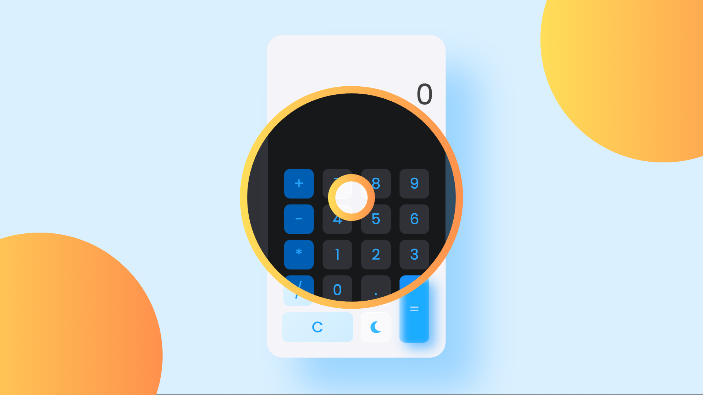

# calculatorJS by Zarnigor2007
calculatorJS is a simple calculator made using HTML, CSS and vanilla JavaScript.

**Key Features:**

 - Simple arithmetic operations (+, -, *, /)
 - Supports decimal operations
 - Day/night mode
   
Design by: https://www.figma.com/community/file/984658356416751911/calculator-app-ui-design-download-free

*Initial Release: 15 Apr 2024*
